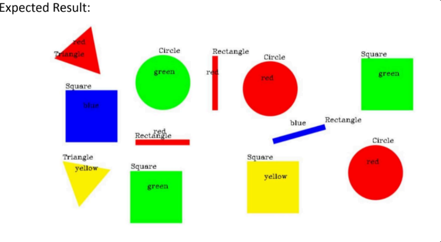
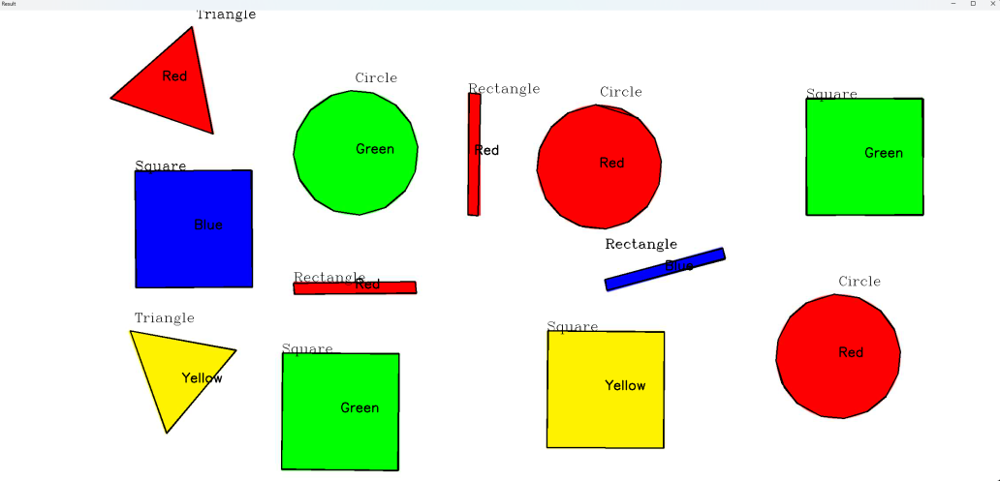

# Task 13.2

- this task shows our work through task 13.1 which reuires shape and color detection using pure image procesing by opencv without using any machine learning.

# Shape Detection
we Finished the codes for the Task we added 3 script files one for the color Detection, shape Detection and the final one was merging the two codes together to get the final Result.

# Some Problems we Faced:

For the Color detection there was a problem with the red color to detect using HSV method it giving some distortion to be clear white for the detection but the another colors worked fine
we Fixed it by using the RGB method for the shapes that has red,green,blue to be accurate on detecting and for complicated yellow color we used the HSV conversion.

For the shape detection we used a canny edge detection to get the edges of the shapes and using it in the contour looping for labeling the shapes but the detection of the canny had some noises that is affecting on the contour so we added a median Filter to smoothing the image and reducing the Noise


## comparison between the expected result and our Final Result

 



---
---
---
# Final code explaination

## 1. **Reading and Preprocessing the Image**
-   `cv2.imread('test.jpg')`: Reads the image from a file named `test.jpg`.
-   Converts the image to different color spaces:
    -   `RGB_img`: Image in RGB format.
    -   `HSV_img`: Image in HSV format for color detection.
    -   `img_gray`: Grayscale image for edge detection.
    
```python
img = cv2.imread('test.jpg')
RGB_img = cv2.cvtColor(img, cv2.COLOR_BGR2RGB)
HSV_img= cv2.cvtColor(img, cv2.COLOR_BGR2HSV)
img_gray = cv2.cvtColor(img, cv2.COLOR_BGR2GRAY)
img_gray_smoothed = cv2.medianBlur(img_gray, 5)
```


## 2. **Edge Detection**

-   `cv2.Canny`: Detects edges using the Canny edge detector. It is done both on the original grayscale image and the smoothed grayscale image to compare results.
```python
edges_without_smoothed = cv2.Canny(img_gray, 50, 100) edges = cv2.Canny(img_gray_smoothed, 50, 100)
```

## 3. **Color Range Definitions**

The script defines color ranges for detecting red, green, yellow, and dark blue objects. The color ranges are defined in both RGB and HSV formats:
```python
lower_bound_r = np.array([50, 0, 0], dtype=np.uint8)
upper_bound_r = np.array([255, 100, 100], dtype=np.uint8)

lower_green = [45, 150, 50]
upper_green = [65, 255, 255]

lower_yellow = [25, 150, 50]
upper_yellow = [35, 255, 255]

lower_dark_blue = [115, 150, 0]
upper_dark_blue = [125, 255, 255]
```

## 4. **Color Detection Function**

The `color_detection` function generates a mask that highlights pixels falling within the specified color range, making the rest of the pixels black.
```python
def color_detection(img, lower_bound, upper_bound):
    mask = np.zeros((img.shape[0], img.shape[1]), dtype=np.uint8)
    first = img[:,:,0]
    second = img[:,:,1]
    third = img[:,:,2]
    for i in range(RGB_img.shape[0]):
        for j in range(RGB_img.shape[1]):
            if (first[i,j] >= lower_bound[0] and first[i,j] <= upper_bound[0]) and (second[i,j] >= lower_bound[1] and second[i,j] <= upper_bound[1]) and (third[i,j] >= lower_bound[2] and third[i,j] <= upper_bound[2]):
                mask[i,j] = 255
            else:
                mask[i,j] = 0
    return mask
```


## 5. **Detecting Colors in the Image**

For each color (red, green, blue, yellow), the script applies the color detection function and then finds the contours of detected colored regions. The color name is placed at the center of each detected object.
```python
colors_and_masks = [('Red', mask_red), ('Green', mask_green), ('Blue', mask_blue), ('Yellow', mask_yellow)]

for color_name, mask in colors_and_masks:
    contours_1, _ = cv2.findContours(mask, cv2.RETR_EXTERNAL, cv2.CHAIN_APPROX_SIMPLE)
    for contour in contours_1:
        x, y, w, h = cv2.boundingRect(contour)
        center_x = x + w // 2
        center_y = y + h // 2
        cv2.putText(img, color_name, (center_x, center_y), cv2.FONT_HERSHEY_SIMPLEX, 1, (0, 0, 0), 2)
```
## 6. **Shape Detection Using Edge Detection**

Using `cv2.findContours` and `cv2.approxPolyDP`, the script approximates the contours to detect shapes. Based on the number of vertices in the contours, shapes are classified as:

-   Triangle (3 vertices)
-   Square or Rectangle (4 vertices)
-   Circle (more than 4 vertices)

For squares and rectangles, the aspect ratio is calculated to differentiate between them.
```python
contours_2, _ = cv2.findContours(edges, cv2.RETR_TREE, cv2.CHAIN_APPROX_NONE)

for contour in contours_2:
    approx = cv2.approxPolyDP(contour, 0.01 * cv2.arcLength(contour, True), True)
    cv2.drawContours(img, [approx], 0, (0, 0, 0), 2)
    x = approx.ravel()[0] + 10
    y = approx.ravel()[1] - 20

    if len(approx) == 3:
        cv2.putText(img, 'Triangle', (x, y), cv2.FONT_HERSHEY_COMPLEX, 1, (0, 0, 0))
    elif len(approx) == 4:
        x, y, w, h = cv2.boundingRect(approx)
        aspectRatio = float(w) / h
        if aspectRatio >= 0.95 and aspectRatio <= 1.05:
            cv2.putText(img, 'Square', (x, y), cv2.FONT_HERSHEY_COMPLEX, 1, (0, 0, 0))
        else:
            cv2.putText(img, 'Rectangle', (x, y), cv2.FONT_HERSHEY_COMPLEX, 1, (0, 0, 0))
    else:
        cv2.putText(img, 'Circle', (x, y), cv2.FONT_HERSHEY_COMPLEX, 1, (0, 0, 0))
```

